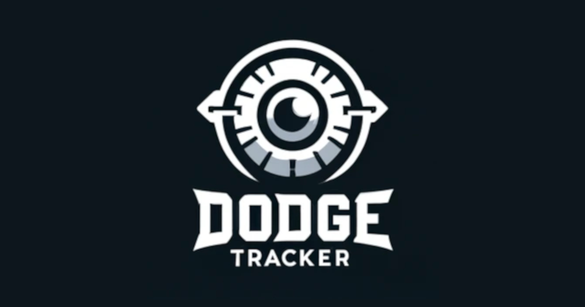

# [Dodgetracker](https://www.dodgetracker.com/)

A League of Legends dodge tracker that tracks all queue dodges in Master, Grandmaster and Challenger. Used by thousands of unique users every week.

## Table of contents

<!--toc:start-->

- [Background](#background)
  - [League of Legends](#league-of-legends)
  - [What is queue dodging?](#what-is-queue-dodging)
- [Purpose](#purpose)
- [Limitations](#limitations)
- [Technologies Used](#technologies-used)
- [Implementation](#implementation)
- [Community Usage](#community-usage)
<!--toc:end-->

## Background

### League of Legends

[League of Legends (LOL)](https://en.wikipedia.org/wiki/League_of_Legends), created by Riot Games, is the world's most popular competitive online PC game as well as the world's largest esport.

### What is Queue Dodging?

To play a ranked game of League of Legends, you queue up to get matched with other players also in queue. When a lobby is found, you press accept to enter [champion selection](https://lol.fandom.com/wiki/New_To_League/Gameplay/Champ_Select). Once in champion selection, each player in both teams picks the [champion](https://leagueoflegends.fandom.com/wiki/Champion) (character) that they want to play. After champion selection is finished, all players load into the actual game and the game begins.

The act of leaving champion selection before it is finished and a game has started is called a queue dodge. There are multiple reasons as to why you might want to leave champion selection, for example you might determine that the enemy team has picked champions that are good against yours, or you realize that you do not have time to actually play a game. Queue dodging can also be unintentional, for example your computer might crash during champion selection.

The [ranking system](<https://leagueoflegends.fandom.com/wiki/Rank_(League_of_Legends)>) in League of Legends is based on league points (LP), when you win a game you gain LP and when you lose a game you lose LP. Queue dodging gives both a LP penalty and a time penalty. When you dodge, you lose LP and you are not allowed to queue up for a new game for a certain amount of time.

- [Riot Games on queue dodging](https://support-leagueoflegends.riotgames.com/hc/en-us/articles/201751844-Queue-Dodging)
- [Unofficial LOL Wiki on queue dodging](https://leagueoflegends.fandom.com/wiki/Queue_dodging)

## Purpose

Queue dodging is an anonymous act, there is no built-in way in the League of Legends client to know which player in your champion selection that dodged. Dodgetracker provides a way for players to know which player left their champion selection, as well as view statistics such as a [leaderboard](https://www.dodgetracker.com/euw/leaderboard) of the players with the most dodges.

Knowing who dodged your champion selection can provide some strategic advantages, especially in high ranks, because you now know that you will not be playing against that player in the next game. Dodgetracker also lets the general public view the dodging habits of League of Legends players, which can provide interesting insights about how they approach champion selection.

## Limitations

Due to limitations of the League of Legends API, Dodgetracker only tracks dodges of players that are ranked master or above. These are roughly the best 1% of players in each region.

## Technologies Used

- Typescript
- Rust
- PostgreSQL
- NextJS
- TailwindCSS
- Drizzle ORM
- Zod (type-safe schema validation for API calls)
- Vercel
- Analytics tools (GoogleAnalytics, Posthog, Google Search Console, StatsPro)

## Implementation

The dodges are detected using an algorithm implemented in Rust ([here](./src/backend/src/main.rs)) that runs 24/7 as a [Linux service](./src/backend/service/dodgetracker.service) on a Ubuntu Server hosted on a Hetzner VPS. In simple terms, this algorithm constantly checks the Master+ ladder using the League of Legends API, if a player loses LP without playing a game or [decaying](<https://leagueoflegends.fandom.com/wiki/Rank_(League_of_Legends)#Decay>) then a dodge is registered. The PostgreSQL database is hosted on the same Hetzner VPS, allowing for fast read/writes between the database and the algorithm due to their close proximity.

The web-application is built using NextJS, TailwindCSS and Typescript ([here](./src/app/)) and is hosted on Vercel.

## Community Usage

In this clip, one of the most popular streamers [Agurin](https://lol.fandom.com/wiki/Agurin) uses Dodgetracker to check who dodged his most recent champion selection, and voices his appreaciation for the site:

https://github.com/isak102/dodgetracker/assets/90389894/2ef368cc-7e15-4f17-80d2-20854e4698cf
